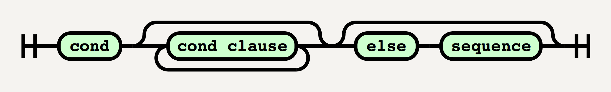

# Lecture 3

## RFC Standard

This is an example of a grammar rule that specifies RFC message.

A valid element specified by this grammar is `<eggert."fsf$3926"@cs.ucla.edu>`

```text
msg-id = "<"word&("."word)"@"atom*("."atom)*">"
word = atom / quoted-string
atom = 1*<any CHAR except specials, SPACE and CTLs>
quoted-string = <">(quoted / quoted-pair)<">
qtext = <any CHAR except "\">
quoted-pair = "\" CHAR
```

## ISO Standards for EBNF

Reference Website: https://www.cl.cam.ac.uk/~mgk25/iso-ebnf.html

### Notation of EBNF

- `"terminal symbol"`
  - Or `'terminal symbol'`
- `(*Comment*)`
- `[Option]`
- `{repetition}`
- `(group)`
- `3*A` 3 repetitions of A
- `A-B` A except not B
- `A,B` A concactenated with B
- `A|B` A or B
- `LHS=RHS` Grammar rule

Now we are going to use this notation to define the grammar of EBNF under ISO standards:

```EBNF
syntax = syntax-rule, {syntax-rule};
syntax-rule = meta-id, "=", defns-list, ";";
defns-list = defn, {"|", defn};
defn = term, {",", term}
term = factor, ["-", exception];
exception = factor;
meta-id = letter, {letter | decimal | digit};
factor = ["integer", "*"], primary
```

The danger here is defining syntax with the syntax itself. Things can go very wrong sometimes if not done carefully.

## What can go wrong for Grammar?

- Nonterminals used but not defined

  ```text
  S -> F (X)
  S -> E
  X -> a
  X -> X a
  E -> b
  E -> b E
  ```

  - An example of the production of S can be:

    ```text
    S -> F (X) -> F (X a) -> F(a a)
    ```

  - There is no way to produce F into terminal symbol.

- Nonterminald defined but never used (Useless Rule)
  - Normal Fix: Remove it

  ```text
  S -> a
  S -> S (Useless)
  ```

- Blind Alley Rule (Refer to homework 1)
- Grammar attempts to extra constraints grammar cannot easily capture (overkill in your grammars; Specify too much)
  - When the grammar is not specified enough

    ```text
    S -> NP VP.
    NP -> noun
    NP -> adj NP
    VP -> verb
    VP -> VP adv
    ```

  - Such grammar will allow erroneous English like
    - Blue dogs bark quietly
    - Blue dog barks quietly

  - So we are going to incorporate more constraints to the grammar

    ```text
    S -> SNP SVP.
    S -> PNP PVP.
    SNP -> snoun
    SNP -> adj snoun
    PNP -> pnoun
    PNP -> adj pnoun 
    SVP -> sverb
    SVP -> SVP adv
    PVP -> pverb
    PVP -> PVP adv
    ```

  - This new grammar, though eliminated the above problem, is considerably more cumbersome. The purpose of grammar here is to help people understand English better. However, such overkill just defeats the point.

## The problem of Ambiguity

Please read Chapter 3 of the textbook.

Theoretical Question:

- Given a grammar, how can we prove that it is not ambiguous.
- Is there an algorithm that helps us check that?

## A Naive Grammar of C (that is ambiguous)

- Stmt
  - ;
  - break;
  - continue;
  - expr;
  - while (expr) stmt
  - if (expr) stmt
  - if (expr) stmt else stmt
  - switch (expr) stmt
  - for ($expr_{opt}$; $expr_{opt}$; $expr_{opt}$) stmt
  - return expr;
  - goto ID;
  - do stmt while (expr);

Parenthesis is required in all except the last rule. If we omit it, there will be ambiguity.

```C
if 1-1;
// can be interpreted as
if (1) -1;
if (1-1);
```

The parenthesis in the last rule is mostly for consistency.

However, there is still an ambiguity left. Consider

```C
if (expr) if (expr) stmt else stmt
// can be interpreted as
if (expr) (if (expr) stmt) else stmt
if (expr) (if (expr) stmt else stmt) // this one is correct
```

Solution? Checkout textbook section 3.5.

## Syntax Diagram

Main advantage: Provide a prototype algorithm for parsing the grammar.

Example: Syntax of the conditional expression in Scheme:

```text
<cond> -> (cond <cond_clause>+)
        | (cond <cond_clause>* (else <sequence>))
```

Here will be the diagram format of the above grammar.



For detail, please read Section 2.7-Other Grammar Form, Syntax Diagrams.

Here is another good reference: [EBNF Syntax Diagrams](http://athena.ecs.csus.edu/~gordonvs/135/resources/05ebnfSyntaxDiagrams.pdf).

In case you want to generate syntax diagram effectively on computer, here is a nice JS+SVG library with Python port: [railroad-diagrams](https://github.com/tabatkins/railroad-diagrams). This is what I used to generate the above diagram.
